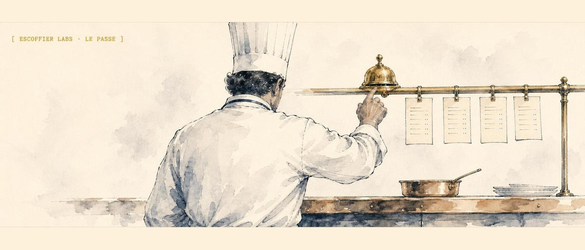

<p align="center">
  
</p>

# Escoffier Labs

Home of [Brigade](https://brigade.tools), the local operator layer for AI agents.

Brigade keeps agent loops receipted, reviewed, and portable. The supporting Escoffier Labs tools provide the stations around it: agent skills, code search, sealed secrets, an evidence ledger of past work, notifications, screenshots, and durable workflow records. Publish-safety scanning ships inside Brigade itself (`brigade scrub` / `brigade guard`).

## Flagship

- [Brigade](https://github.com/escoffier-labs/brigade) - local operator layer for AI agent memory, handoffs, and guardrails across every harness.

## Skills & guides

- [Skillet](https://github.com/escoffier-labs/skillet) - agent skills suite: repo audits, bug hunting, security sweeps, publish gates, releases, and memory handoffs.
- [Solos Cookbook](https://github.com/escoffier-labs/solos-cookbook) - how one engineer runs a 24/7 multi-agent AI stack on bare metal.

## Agent ops

- [Agent Pantry](https://github.com/escoffier-labs/agentpantry) - secure browser session and secret sync for agent machines.
- [Memory Doctor](https://github.com/escoffier-labs/memory-doctor) - maintenance CLI for the Claude Code and OpenClaw memory systems.
- [Bootstrap Doctor](https://github.com/escoffier-labs/bootstrap-doctor) - audits and trims oversize OpenClaw prefix files into reference cards.
- [Agent Notify](https://github.com/escoffier-labs/agent-notify) - privacy-first push notifications for AI coding agents.
- [Cloche](https://github.com/escoffier-labs/cloche) - agent-neutral app screenshot capture.

## Dev tools

- [Code Search API](https://github.com/escoffier-labs/code-search-api) - local semantic code search with Ollama embeddings, SQLite, and hybrid search.
- [Code Search MCP](https://github.com/escoffier-labs/code-search-mcp) - read-only MCP server and OpenClaw plugin for Code Search API.
- [GraphTrail](https://github.com/escoffier-labs/graphtrail) - local code-graph CLI and read-only MCP server: callers, callees, impact, and context across a codebase.
- [Usage Tracker](https://github.com/escoffier-labs/usage-tracker) - token usage and cost analytics for OpenClaw sessions across models.
- [Mise en Scene](https://github.com/escoffier-labs/mise-en-scene) - turns source material into self-contained interactive HTML/SVG technical explainers.
- [Plating](https://github.com/escoffier-labs/plating) - reproducible, sanitized terminal-demo SVGs for READMEs and websites.
- [Escoffier Fleet Kit](https://github.com/escoffier-labs/escoffier-fleet-kit) - shared theme, OG cards, and hands-off publishing for the Escoffier Labs website fleet.
- [Token Glace](https://github.com/escoffier-labs/token-glace) - deterministic output compaction that trims terminal noise before it hits agent context; the Token Glace fork of vincentkoc/tokenjuice.

## Evidence stack

- [MiseLedger](https://github.com/escoffier-labs/miseledger) - local-first evidence ledger for AI work history, with built-in session, file, git, and chat crawlers (`miseledger crawl ...`; the former StationTrail and SourceHarvest exporters are absorbed and archived).

## Start here

```sh
pipx install brigade-cli
```

Read the [Brigade docs](https://brigade.tools/docs), then use the supporting stations as your workflow needs them.
